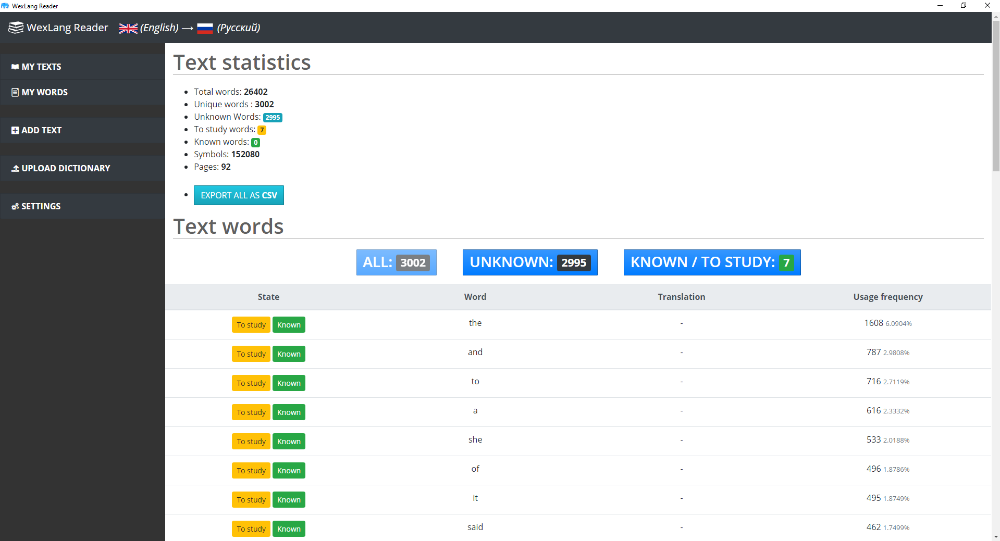
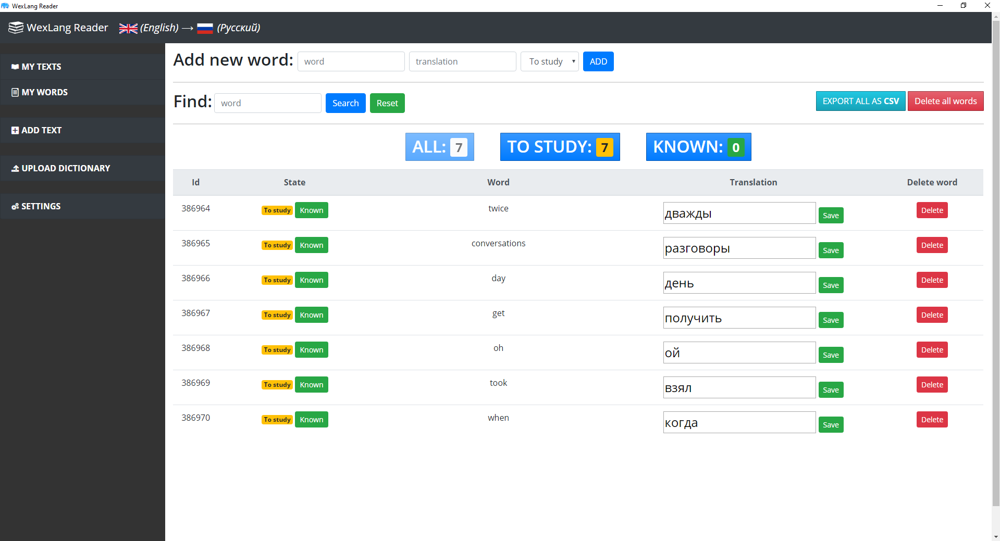
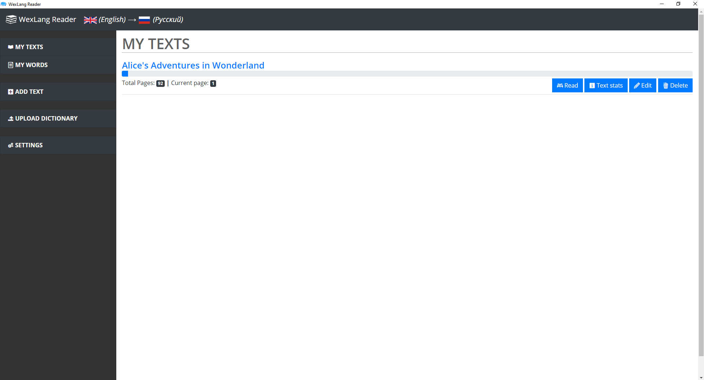

# WexLangReader 1.1 (Desktop)
### 104 languages, any translation direction.
 

 

 

Language learning app. Learn a language by reading whatever you like.

Just start **WexLangReader/WexLangReader.exe**

